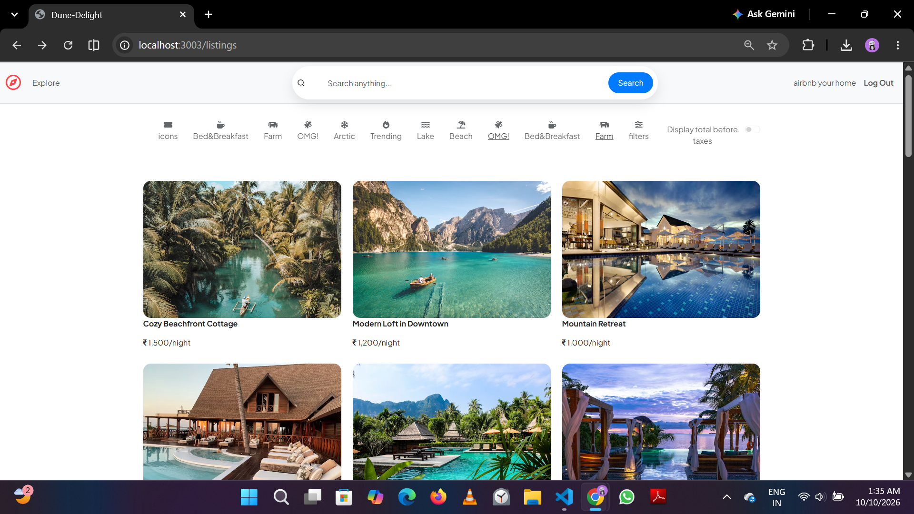
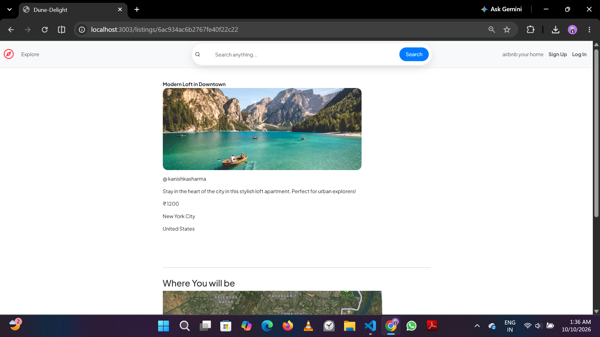
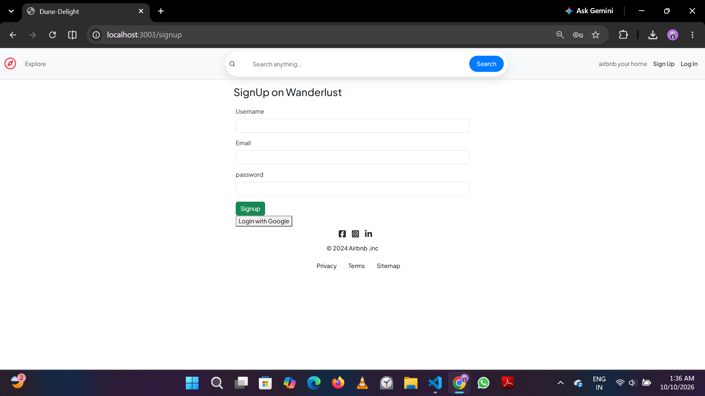
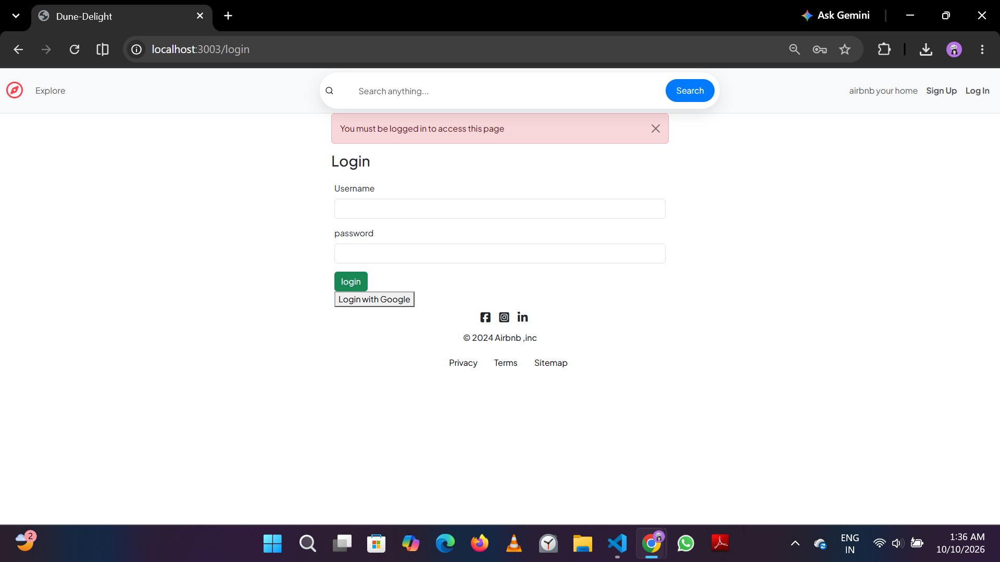
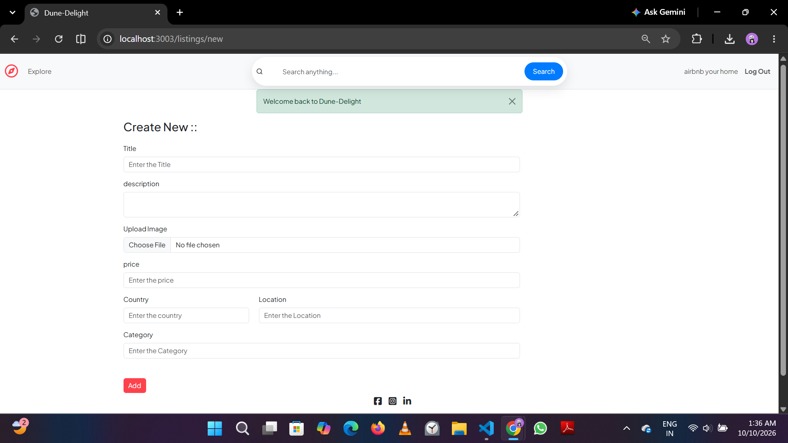
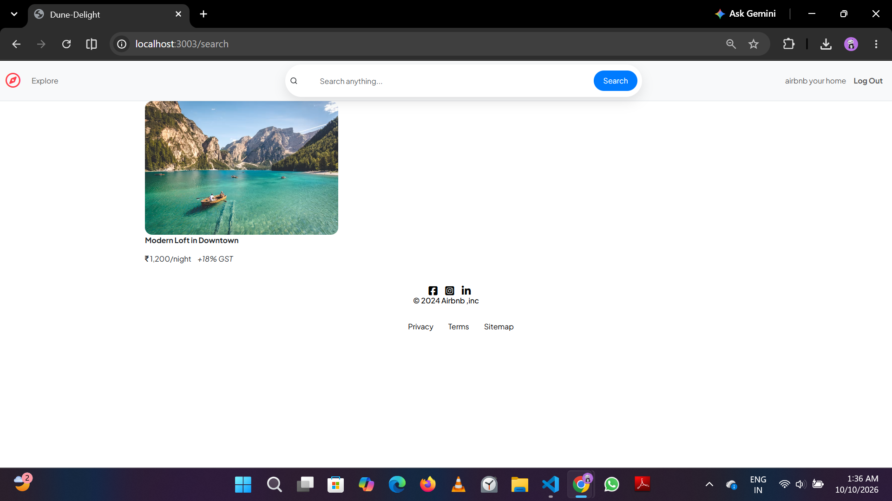

# 🏜️ Dune Delight – Your Vacation Stay Companion
🔗 **Live Demo:** [https://airbnb-project-n4n5.onrender.com](https://airbnb-project-n4n5.onrender.com)

> Hosted on Render's free tier, so the first load may take 30-50 seconds.

Dune Delight is a full-stack vacation rental web application inspired by Airbnb. It allows users to explore, book, and manage vacation homes seamlessly. Built with Node.js, Express, MongoDB, and EJS templates, Dune Delight delivers a smooth and dynamic booking experience.

🌟 Project Name Meaning
Dune Delight is a combination of two words:

Dune – A sweeping hill of sand shaped by the wind, a symbol of open, scenic landscapes.

Delight – A feeling of great joy and pleasure.

Together, Dune Delight represents the idea of enjoying beautiful vacation homes in stunning locations – exactly what the app helps users find and book!

# ✨ Features

🔍 Browse and search vacation listings

📆 Book stays with date selection

📩 Email confirmations and PDF booking tickets

👤 User profiles with booking history

🖼️ Cloudinary integration for image uploads

🔐 Authentication & authorization with Passport.js

# 🔧 Tech Stack
Backend: Node.js, Express.js, MongoDB, Mongoose

Frontend: EJS Templates, Bootstrap/CSS

Authentication: Passport.js (Google & Local Strategy)

File Storage: Cloudinary

Email Service: Nodemailer

# 🚀 Project Goal

Dune Delight aims to simulate a real-world vacation rental platform, helping developers understand full-stack architecture, secure payment integration, and user-friendly booking flows.

# Screenshots

